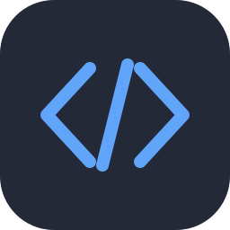
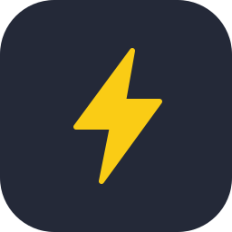
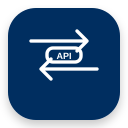

<p align="center">
  
</p>

<p align="center">
  <a href="https://github.com/rehman-al">
    
  </a>
</p>

<p align="center">
  <a href="mailto:pedro.sales.rehmanjackuuuu@gmail.com">
    
  </a>
  <a href="https://codecrafter-me.netlify.app/">
    
  </a>
  <a href="https://github.com/rehman-al">
    
  </a>
</p>

<br/>

## 🧑‍💻 About Me

```apex
public with sharing class RehmanAli extends Developer {

    String location = 'Pakistan';

    List<String> roles = new List<String>{
        'Salesforce Developer',
        'MERN Stack Developer'
    };

    Map<String, List<String>> stack = new Map<String, List<String>>{
        'salesforce' => new List<String>{ 'Apex', 'LWC', 'Flow', 'REST' },
        'clouds'     => new List<String>{ 'Sales', 'Service', 'Experience',
                                          'Data', 'Marketing', 'OMS' },
        'web'        => new List<String>{ 'MongoDB', 'Express', 'React', 'Node' }
    };

    @AuraEnabled
    public static String motto() {
        return 'Building scalable Salesforce solutions, '
             + 'integrations and modern web applications.';
    }
}
```

<br/>

## ☁️ Salesforce Ecosystem

<div align="center">

<table>
  <tr>
    <td align="center" width="96"><br/><sub><b>Salesforce</b></sub></td>
    <td align="center" width="96"><br/><sub><b>Sales Cloud</b></sub></td>
    <td align="center" width="96"><br/><sub><b>Service Cloud</b></sub></td>
    <td align="center" width="96"><br/><sub><b>Experience Cloud</b></sub></td>
    <td align="center" width="96"><br/><sub><b>Data Cloud</b></sub></td>
    <td align="center" width="96"><br/><sub><b>Marketing Cloud</b></sub></td>
  </tr>
  <tr>
    <td align="center" width="96"><br/><sub><b>Order Mgmt</b></sub></td>
    <td align="center" width="96"><br/><sub><b>Apex</b></sub></td>
    <td align="center" width="96"><br/><sub><b>LWC</b></sub></td>
    <td align="center" width="96"><br/><sub><b>Flow</b></sub></td>
    <td align="center" width="96"><br/><sub><b>REST APIs</b></sub></td>
    <td align="center" width="96"><br/><sub><b>SFDC</b></sub></td>
  </tr>
</table>

</div>

<br/>

## ⚒️ Tech Stack

<div align="center">

<table>
  <tr>
    <td align="center" width="130"><b>Frontend</b></td>
    <td></td>
  </tr>
  <tr>
    <td align="center" width="130"><b>Backend &amp; Data</b></td>
    <td></td>
  </tr>
  <tr>
    <td align="center" width="130"><b>Languages</b></td>
    <td></td>
  </tr>
  <tr>
    <td align="center" width="130"><b>Tools</b></td>
    <td></td>
  </tr>
</table>

</div>

<br/>

## 📊 GitHub Stats

<p align="center">
  
  
</p>

<p align="center">
  
</p>

<p align="center">
  <picture>
    <source media="(prefers-color-scheme: dark)" srcset="https://raw.githubusercontent.com/rehman-al/rehman-al/output/github-snake-dark.svg" />
    
  </picture>
</p>

<p align="center">
  
</p>


