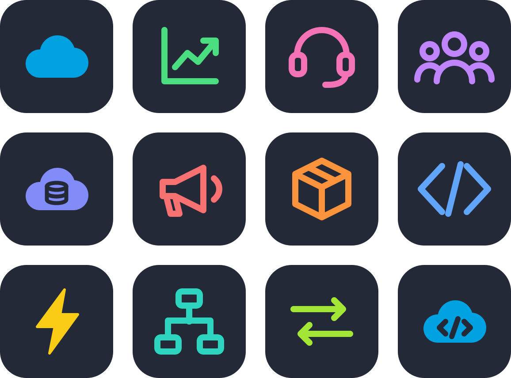

<p align="center">
  
</p>

<p align="center">
  
  <br/>
  <a href="mailto:pedro.sales.rehmanjackuuuu@gmail.com"></a>
  <a href="https://codecrafter-me.netlify.app/"></a>
  <a href="https://github.com/rehman-al"></a>
  
</p>

<div align="center">
<table>
  <tr>
    <th>☁️ Salesforce</th>
    <th>⚒️ Tech Stack</th>
  </tr>
  <tr>
    <td align="center"></td>
    <td align="center"></td>
  </tr>
  <tr>
    <td align="center"><sub>Sales · Service · Experience · Data · Marketing · OMS<br/>Apex · LWC · Flow · REST</sub></td>
    <td align="center"><sub>MERN · Python · C++ · Rust<br/>Docker · Git · Linux</sub></td>
  </tr>
</table>
</div>

<p align="center">
  
  
</p>

<details>
<summary><b>🧑‍💻 More about me</b> — <code>RehmanAli.cls</code> (click to open)</summary>

```apex
public with sharing class RehmanAli extends Developer {

    String location = 'Pakistan';

    List<String> roles = new List<String>{
        'Salesforce Developer',
        'MERN Stack Developer'
    };

    Map<String, List<String>> stack = new Map<String, List<String>>{
        'salesforce' => new List<String>{ 'Apex', 'LWC', 'Flow', 'REST' },
        'clouds'     => new List<String>{ 'Sales', 'Service', 'Experience',
                                          'Data', 'Marketing', 'OMS' },
        'web'        => new List<String>{ 'MongoDB', 'Express', 'React', 'Node' }
    };

    @AuraEnabled
    public static String motto() {
        return 'Building scalable Salesforce solutions, '
             + 'integrations and modern web applications.';
    }
}
```

</details>

<picture>
  <source media="(prefers-color-scheme: dark)" srcset="https://raw.githubusercontent.com/rehman-al/rehman-al/output/github-snake-dark.svg" />
  
</picture>


